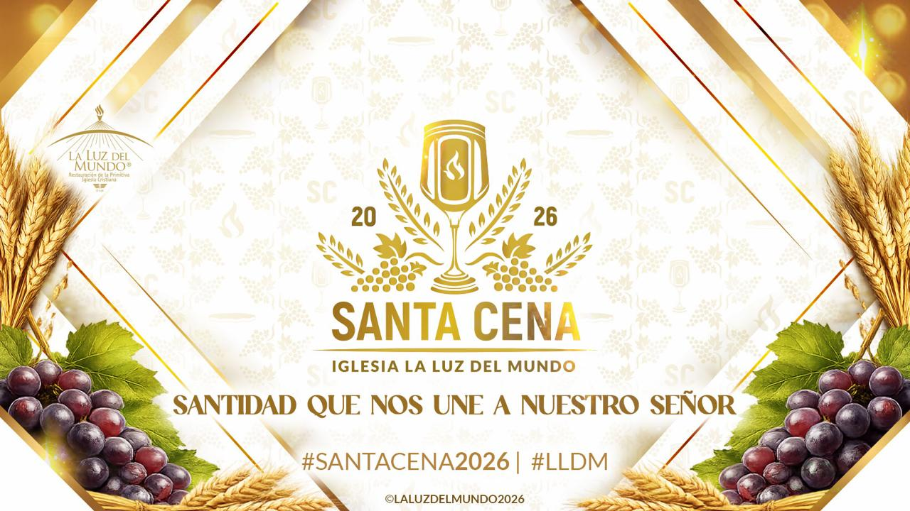

# Santa Cena — transmisión en vivo

Página estática de una sola pantalla para la transmisión diaria. Solo HTML y CSS,
sin JavaScript y sin dependencias que compilar.

```
index.html    la página
styles.css    los estilos
index4.html   copia de santaconvocacionlldm.org/index-scna2026.html
              con las noticias en vivo (ver abajo)
index5.html   igual que index4, pero sin el video: en su hueco va el
              cartel de la Santa Cena 2026
index5Eng.html  la versión en inglés de index5, con las noticias de
              holysupper.org en vez de santaconvocacionlldm.org
images/       imágenes propias del repositorio
```

`index4.html` se queda como está a propósito, para poder comparar las dos o
volver atrás. Los cambios nuevos van en `index5.html`.

## `index5.html` — sin video, con el cartel

Lo mismo que `index4.html`, con un cambio: el reproductor de YouTube del intro
ya no está. En su hueco — misma medida (560px, 16:9), mismo sitio, centrado
igual — va `images/santacena2026.jpg`, el cartel oficial de la Santa Cena 2026.

La imagen vive en el repositorio, no enlazada desde Google Drive: Drive corta
los enlaces directos a imágenes y obligaría a dejar el archivo público para
siempre.

### Cambiar el cartel por el video

Los estilos son del contenedor, no de lo que va dentro, así que el marco no se
mueve: sirve igual una imagen, un `<iframe>` o un `<video>`.

En `index5.html`, busca `id="video-hueco"`. Verás esto:

```html
<div class="video-hueco" id="video-hueco">
    
</div>
```

Cambia la línea del `` por esta otra, poniendo el identificador del video
donde dice `ID_DEL_VIDEO`:

```html
<iframe src="https://www.youtube.com/embed/ID_DEL_VIDEO" title="Video"
        allow="accelerometer; autoplay; clipboard-write; encrypted-media; gyroscope; picture-in-picture; web-share"
        referrerpolicy="strict-origin-when-cross-origin" allowfullscreen></iframe>
```

El identificador es lo que sigue a `v=` en el enlace de YouTube
(`youtube.com/watch?v=dECnseeljYw` → `dECnseeljYw`).

No hay que tocar nada más: ni el ancho, ni el alto, ni el centrado. Comprobado
a 1440 y a 390px — el video queda exactamente en el hueco del cartel.

Para volver al cartel, se deshace el cambio. Y si algún día conviene tener los
dos, cabe dejar la imagen debajo del video dentro del mismo `div`.

## `index5Eng.html` — la misma página, en inglés y con las noticias de Holy Supper

Copia de `index5.html` (mismo cartel, mismo diseño, mismo listado que se
actualiza solo) con dos diferencias:

1. **De dónde salen las entradas.** El bloque **NOTICIAS DINÁMICAS** apunta al
   sitio en inglés:

   ```js
   var CFG = {
       sitio      : 'https://holysupper.org',
       categoria  : 2,             // 2 = "Holy Supper"
       porPagina  : 9,
       refrescoMs : 5 * 60 * 1000
   };
   ```

   Esas entradas las pone el bot `lldm-fb-sync` desde la página de Facebook
   *Holy Supper TLOTW*, y el archivo de 2024 ya está publicado (91 entradas),
   así que la página trae contenido desde el primer día. Lo que se sincronice de
   ahora en adelante entra como borrador y sale aquí en cuanto alguien le da
   `/publish` en Telegram — el mismo circuito de siempre.

2. **Todo el texto visible está en inglés**: el menú, el titular del intro
   (*A call to communion with Christ*), el pie, y también los textos que arma el
   JavaScript (*See more posts*, *Read post*, *Showing 9 of 91 posts*, los
   avisos de error). Las fechas se formatean con `en-US`, así que salen como
   *August 26, 2024* en vez de *26 de agosto de 2024*. Los comentarios del
   código siguen en español, como en el resto del repositorio.

Los favicons apuntan a `holysupper.org/images/…` (existen, comprobado). El
enlace de Facebook de la cabecera y del intro va a `facebook.com/holysupper`.

**Dos cosas quedaron a propósito como estaban** — se cambian en cuanto haya con
qué:

- El cartel del hueco del intro sigue siendo `images/santacena2026.jpg`, el de
  la Santa Cena 2026 en español. No hay una versión en inglés en el repositorio.
  Se cambia igual que se explica arriba para el video.
- Los enlaces de Instagram y X siguen siendo los de `santaconvocacionlldm` — no
  se conocen cuentas propias de Holy Supper. Si las hay, están en dos sitios en
  el archivo (cabecera e intro).

## `index4.html` — noticias en vivo desde WordPress

Es la misma página de `santaconvocacionlldm.org/index-scna2026.html`, con un
cambio: donde antes había un `<iframe>` fijo apuntando a
`lldmcentenario.org/scna_sample/`, ahora hay un listado que se arma solo leyendo
la API REST de WordPress del sitio.

No hay nada que regenerar ni volver a subir. **Cuando una entrada se publica en
`santaconvocacionlldm.org`, aparece aquí sola**: al abrir la página, cada cinco
minutos mientras esté abierta, y al volver a la pestaña después de un rato. Si el
visitante todavía está en la primera tanda, la lista se refresca sin que lo note;
si ya pulsó *Ver más publicaciones*, sale un botón para actualizar y no moverle
el suelo mientras lee.

Los borradores no salen: la API solo entrega lo publicado. Así que el circuito
completo es el de siempre — el bot sincroniza el post de Facebook, alguien lo
revisa y le da `/publish` en Telegram, y en cuanto está publicado la página lo
muestra.

### Lo que se puede ajustar

Al final de `index4.html`, en el bloque marcado **NOTICIAS DINÁMICAS**:

```js
var CFG = {
    sitio      : 'https://santaconvocacionlldm.org',
    categoria  : 11,            // 11 = "Santa Convocación"; null = todas
    porPagina  : 9,             // tarjetas por tanda
    refrescoMs : 5 * 60 * 1000  // cada cuánto busca entradas nuevas
};
```

El resto (imagen destacada, fecha, resumen, enlace) sale de la propia entrada.
Si una entrada no trae imagen destacada, en su lugar va un recuadro azul con el
monograma.

### Notas

- Funciona desde cualquier dominio porque WordPress responde con
  `Access-Control-Allow-Origin`. Si algún día el sitio deja de mandar esa
  cabecera, el listado mostrará un aviso con botón de reintentar en vez de
  quedarse en blanco.
- Los favicons se cambiaron a URL absoluta porque las rutas `/images/…` del
  original no existen bajo `rubenmarchan.github.io/SantaCena/`.
- Se quitó la sección de Instagram del final (`#contact`), que en el original
  era un marcador de posición sin terminar — decía *"embed of holysupper
  iglesia.lldm"*, con media frase en blanco sobre fondo blanco. Con ella se
  quitó su entrada del menú (*Newsletter*), que apuntaba a esa ancla. Los
  enlaces al perfil de Instagram siguen en la cabecera y en el intro.
- Los años del menú pasaron de 2025 a 2026.
- *Ceremonia de Bautismos 2026* y *Ceremonia de Santa Cena 2026* apuntan a `#`.
  En el original iban a `#services` y `#portfolio`, secciones que no existen en
  la página. Con `#`, la librería MoveTo del tema lo trata aparte y sube al
  principio en vez de no hacer nada. Cuando esas secciones existan, basta con
  devolverles su ancla.

### El reproductor del intro

Dos arreglos respecto al original:

- **Centrado.** El recuadro del video es un `div` de 560px sin márgenes, así que
  se quedaba pegado a la izquierda aunque el título de arriba fuera centrado.
  Ahora lleva `margin: 0 auto` y queda centrado en cualquier ancho.
- **Se veía "This video is private".** El recuadro es una miniatura de
  `dECnseeljYw` que carga el video al pulsarla, pero traía dentro un `<iframe>`
  de otro video, `nwDqFtZp3ms`, que YouTube ya no sirve (403). Ese iframe tapaba
  la miniatura con el aviso de video privado. Se quitó, y el reproductor hace lo
  que ya pretendía hacer: muestra la miniatura y al pulsarla arranca
  *Ecos de la Santa Cena 2025 en Hermosa Provincia*.

Si en algún momento hay que cambiar el video, es el identificador
`dECnseeljYw` — aparece tres veces seguidas en el bloque `.lite-yt`
(id, miniatura de fondo y `src` del reproductor que se carga al pulsar).

## Cambiar el video de cada día

Abre `index.html` y busca el bloque marcado **VIDEO DEL DÍA**. Reemplaza
`VIDEO_ID` por el identificador del video de hoy:

```html
<iframe src="https://www.youtube-nocookie.com/embed/VIDEO_ID" ...>
```

El identificador es la parte que sigue a `v=` en el enlace de YouTube:

```
https://www.youtube.com/watch?v=dQw4w9WgXcQ
                                └─── esto ───┘
```

Es lo único que cambia cada día.

### Alternativa: que no haya que editar nada

Si la transmisión siempre sale del mismo canal, usa esta dirección y YouTube
mostrará solo lo que esté en vivo en ese canal:

```html
<iframe src="https://www.youtube-nocookie.com/embed/live_stream?channel=ID_DEL_CANAL" ...>
```

El `ID_DEL_CANAL` empieza con `UC…` y se encuentra en la configuración avanzada
del canal. La contrapartida: cuando no hay transmisión activa el reproductor
aparece vacío, así que para un evento con fecha fija el ID de video es más
seguro.

## Textos que conviene revisar

En `index.html`:

- **`8:00 PM`** en la sección *Horario* — es un valor de ejemplo, ponle la hora real.
- **`Hoy`** junto a *En vivo* — si prefieres una fecha concreta, escríbela ahí.
- El pie de página.

## Publicar con GitHub Pages

En el repositorio: **Settings → Pages → Source: Deploy from a branch**, rama
`main`, carpeta `/ (root)`. La página queda en
`https://rubenmarchan.github.io/SantaCena/` en un par de minutos.

## Notas de diseño

- Azul noche `#04182b`, azul de marca `#082746`, oro `#cbb058`, lino `#f7f5f1`.
- Tipografías Cinzel (título) y Karla (texto), desde Google Fonts.
- El único elemento con brillo es el marco del video: la transmisión es lo que
  ilumina la página. Todo lo demás se mantiene apagado a propósito.
- Se adapta a móvil, respeta `prefers-reduced-motion` y usa `youtube-nocookie`
  para no dejar cookies de seguimiento antes de que alguien le dé play.
